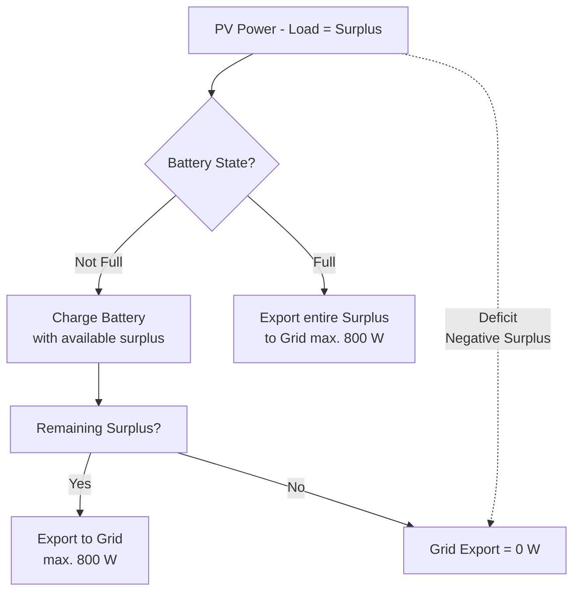

# Home Assistant PV Zero Export Blueprint

This repository provides a **Home Assistant Blueprint** to dynamically control the **grid export power (0–800 W)** of a photovoltaic system with battery storage.  
The goal is to achieve **zero export** while maximizing **self-consumption**.

## ⚡ How it works

- **Deficit (PV < Load):** Grid export = 0 W.
- **Surplus (PV > Load):**
  - If the battery is **not full** → surplus is used to charge the battery (up to max charging power).
  - If the battery is **full** → remaining surplus can be exported to the grid (max 800 W).
- **Deadband & update interval** prevent fast switching.
- **SOC reserve** protects the battery from deep discharge.

## 🛠️ Requirements

- Home Assistant (>= 2024.8 recommended)
- Entities required:
  - **PV production power (W)**
  - **Household consumption power (W)**
  - **Battery charge (kWh)**
  - **Battery capacity (kWh)**
  - **Battery max charge power (W)**
  - **Battery max discharge power (W)**
- A controllable **Number entity** for grid export (range 0–800 W),  
  usually provided by the inverter or EMS (Energy Management System).

## 📥 Installation

1. Download the file [`pv_zero_export.yaml`](./pv_zero_export.yaml).
2. In Home Assistant:  
   Go to **Settings → Automations & Scenes → Blueprints → Import Blueprint**.  
   Upload the YAML file or paste the GitHub raw file URL.
3. Create a new automation from the Blueprint and map your entities.

## ⚙️ Configurable parameters

- **Update interval** (default: 10 s)  
- **Deadband (hysteresis)** (default: 50 W)  
- **Battery SOC thresholds**: "full" (98 %) and "reserve" (10 %)  
- **Export limits** (default: 0–800 W)

## 📊 Control logic

